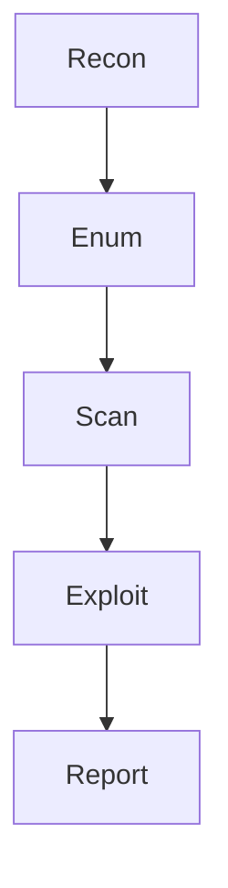

# 🧭 WordPress Pentesting Cheatsheet

`#wordpress #pentesting #cheatsheet #vapt`

> [!info] Usage  
> Quick reference for **enumeration → exploitation → reporting**

---

## ⚡ Quick Start Commands

```bash
wpscan --url https://target.com -e u,vp,vt
whatweb https://target.com
curl -I https://target.com
```

---

## 🔍 WordPress Detection

-  Check HTML source → `/wp-content/`, `/wp-includes/`
    
-  Login panel → `/wp-login.php`
    
-  Admin panel → `/wp-admin/`
    

```bash
whatweb https://target.com
```

```bash
curl -s https://target.com | grep -i wordpress
```

---

## 👤 User Enumeration

### 🔹 WPScan

```bash
wpscan --url https://target.com -e u
```

### 🔹 Author ID Enumeration

```
https://target.com/?author=1
```

> [!tip]  
> Redirect often reveals the **username**

---

## 🔌 Plugin Enumeration

-  Run WPScan
    

```bash
wpscan --url https://target.com -e ap
```

-  Manual check
    

```
https://target.com/wp-content/plugins/
```

---

## 🎨 Theme Enumeration

-  Run WPScan
    

```bash
wpscan --url https://target.com -e at
```

-  Manual check
    

```
https://target.com/wp-content/themes/
```

---

## 📂 Important Files & Endpoints

-  `/wp-config.php`
    
-  `/xmlrpc.php`
    
-  `/wp-json/wp/v2/users`
    
-  `/readme.html`
    
-  `/license.txt`
    

```bash
curl https://target.com/xmlrpc.php
```

```bash
curl https://target.com/wp-json/wp/v2/users
```

---

## 🌐 Subdomain & Surface Expansion

```bash
subfinder -d target.com
amass enum -d target.com
httpx -l subs.txt
```

---

## 📁 Directory Bruteforce

-  Run scan
    

```bash
gobuster dir -u https://target.com -w wordlist.txt -t 50
```

> [!note] Look for
> 
> - `/backup`
>     
> - `/uploads`
>     
> - `.zip`, `.sql`, `.bak`
>     

---

## 🔐 Login & Authentication Testing

### 🔹 Bruteforce

```bash
wpscan --url https://target.com -U users.txt -P passwords.txt
```

### 🔹 XML-RPC Bruteforce

```bash
wpscan --url https://target.com --passwords passwords.txt --usernames admin --xmlrpc
```

> [!warning]  
> XML-RPC allows **multiple login attempts per request**

---

## 🧪 Vulnerability Testing

### 🔹 XSS

```html
<script>alert(1)</script>
```

-  Reflected
    
-  Stored
    
-  DOM-based
    

---

### 🔹 SQL Injection

```sql
' OR 1=1 --
```

-  Login forms
    
-  Search fields
    
-  Parameters
    

---

### 🔹 LFI / Path Traversal

```bash
../../../../etc/passwd
```

-  File download endpoints
    
-  Include parameters
    

---

### 🔹 File Upload Bypass

-  `.php.jpg`
    
-  `.phtml`
    
-  MIME type bypass
    

```bash
echo "test" > shell.php.txt
```

---

## 🔎 WPScan Advanced Usage

```bash
wpscan --url https://target.com --enumerate u,vp,vt --api-token YOUR_TOKEN
```

```bash
wpscan --url https://target.com --plugins-detection aggressive
```

```bash
wpscan --url https://target.com --force
```

---

## 🧠 Common Weak Points

> [!danger] High-Risk Areas

-  Outdated plugins/themes
    
-  Weak admin credentials
    
-  XML-RPC enabled
    
-  File upload forms
    
-  Exposed backups
    
-  Misconfigured permissions
    

---

## 📊 Security Headers Check

```bash
curl -I https://target.com
```

-  X-Frame-Options
    
-  Content-Security-Policy
    
-  Strict-Transport-Security
    

---

## 🔐 SSL Testing

```bash
sslscan target.com
```

```bash
testssl.sh target.com
```

---

## 🧾 Post-Exploitation Checklist

-  Access `wp-config.php`
    
-  Dump database
    
-  Check `.env`
    
-  Find backups
    
-  Admin access
    

---

## 📝 Reporting Template

> [!success] Include

-  Vulnerability
    
-  CVE
    
-  Impact
    
-  Proof of Concept
    
-  Fix / Recommendation


---

## ⚡ Workflow


